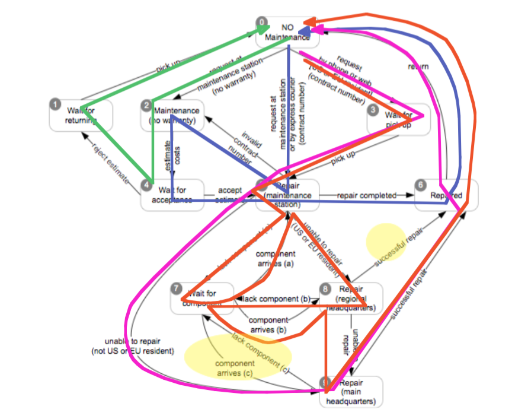

# Pruebas funcionales

- También conocidas como:
	- Pruebas basadas en especificaciones
	- Pruebas de caja negra (no tenemos en cuenta el código)
- Pruebas funcionales: derivamos los casos de prueba a partir de las especificaciones del programa
- Entendemos especificaicón funcional como una descripción del comportamiento esperado del sistema
	- Ya sea formal o informal

## Pruebas sistemáticas VS. aleatorias

- Pruebas aleatorias (uniformes)
	- Se seleccionan entradas uniformemente
	- Evitamos vicios del diseñador
		- El diseñador de pruebas puede cometer los mismos errores y suposiciones erróneas que el diseñador del programa
	- Todas las posibles entradas son equiprobables
- Pruebas sistemáticas (no uniformes)
	- Se intenta seleccionar pruebas de especial interés
	- Habitualmente eligiendo representantes de las clases de valores con posibilidades de fallo

## Las pruebas funcionales son pruebas sistemáticas

- Los errores no se distribuyen de forma uniforme
- Los valores de error están dispersos en el espacio de entrada... agujas en un inmenso pajar !
- Es muy improbable que un muestreo aleatorio elija valores `a = 0` y `b = 0`
- Para buscar una aguja en un pajar:
	- Busca de forma sistemática, no uniforme
	- Necesitamos utilizar toda la información disponible sobre agujas y pajares
	- Los errores suelen esconderse en los "rincones" del comportamiento

## El principio de la partición

- Explota el conocimiento que tienes para seleccionar muestras que son más probables de incluir regiones del espacio de entradas "especiales" o propensas a fallos
	- Los fallos están dispersos por todo el espacio de entradas...
	- ... pero podemos encontrar regiones en las que abunden
- Pruebas de (cuasi-)particiones: separamos el espacio de entradas en clases cuya unión constituye el espacio completo
	- "cuasi" porque puede haber solapamientos
- Dependemos de heurísticos basados en la experiencia

## Pruebas funcionales: explotando la especificación

- Particionamos el espacio de búsqueda utilizando la especificación
- Probamos cada categoría, y los bordes entre estas
- A veces carecemos de dicha especificación
	- O es informal, textual
	- O simplemente no hay forma de darla (GUIs, usabilidad...)

## Funcionales (caja negra) VS. Estructurales (caja blanca)

- Diferentes estrategias de pruebas son más efectivas para encontrar diferentes tipos de errores
	- Funcionales
	- Estructurales
	- Basadas en fallos
	- Basadas en modelos
- Las pruebas funcionales son especialmente buenas encontrando fallos de "lógica perdida"
	- Alguna funcionalidad no fue implementada
	- Pruebas estructurales jamás encontrarán errores en un código que no está

### Funcionales VS. Estructurales: niveles de granularidad

- Las pruebas funcionales se aplican a todos los niveles
	- Unidad (a partir de las especificaciones de interfaces de módulos)
	- Integración (a partir de las especificaciones de APIs o subsistemas)
	- Sistema (a partir de las especificaciones de requisitos del sistema)
	- Regresión (a partir de los requisitos del sistema y el historial de bugs)
- Las estructurales son aplicables a partes relativamente pequeñas del sistema:
	- Unidad
	- Integración

## De especificaciones a casos de prueba

- Descomponemos la especificación
	- Características probables independientemente
- Seleccionamos representantes
	- De los valores para cada entrada o
	- De los comportamientos de un modelo
- Producimos las especificaciones de pruebas
	- Combinaciones de valores de entradas o comportamientos del modelo
- Producimos y ejecutamos las pruebas

## Un ejemplo: `find`

- Un comando: `find`
- Sintaxis: `find <pattern> <filename>`
- Funcionamiento: se utiliza para localizar una o más instancias de un patrón en un fichero. Las líneas del fichero que encajan con el patrón se muestran en la salida estándar. Una línea que contiene el patrón se escribe exactamente una vez, independientemente de si el patrón ocurre una o más veces en la línea. El patrón es una secuencia de caracteres cuya longitud no excede la longitud máxima de una línea del fichero. Para incluir espacios en blando en el patrón, el patrón ha de ir encerrado entre comillas (""). Para incluir comillas en el patrón, deben usarse dobles comillas.

### Identificamos ITFs

- La especificación es pequeña, en este caso tenemos un único ITF, la colección de líneas devuelta contiene el patrón y aquellas líneas que no están en la colección no lo tienen.
- Identificamos ITFs adicionales correspondientes a condiciones de error: problemas con el fichero o con el nombre del fichero o patrones mal formados
- Nuestros ITFs:
	- Identifica correctamente patrones mal formados
	- Identifica correctamente nombres de ficheros incorrectos y otros problemas relacionados con ficheros
	- Identifica correctamente las líneas que contienen el patrón:
		- Identifica el patrón en una línea
		- Identifica el patrón en todas las líneas que aparece

### Identificamos las categorías

- Parámetro patrón
	- Tamaño del patrón
	- Dobles comillas
	- Espacios en blanco
	- Dobles comillas dentro del patrón
- Parámetro nombre de fichero
	- Lo asumimos correcto para este ITF
- Entorno: fichero correspondiente al nombre del fichero
	- Número de ocurrencias del patrón en el fichero
	- Número de ocurrencias del patrón en una línea del fichero

### Particionamos las categorías

- Parámetro patrón
	- Tamaño del patrón: vacío, de un caracter, de varios, demasiado largo
	- Dobles comillas: con comillas, sin comillas
	- Espacios en blanco: ninguno, uno, varios
	- Dobles comillas dentro del patrón: ninguno, uno, varios
- Parámetro nombre de fichero
	- Lo asumimos correcto para este ITF
- Entorno: fichero correspondiente al nombre del fichero
	- Número de ocurrencias del patrón en el fichero: ninguno, uno, varios
	- Número de ocurrencias del patrón en una línea del fichero: ninguno, uno, varios
- Sin restricciones: 4 x 2 x 3 x 3 x 3 x 2 = 432 posibilidades

### Restricciones

- Si el tamaño del patrón es cero no tiene sentido considerar varias comillas o varios espacios en blanco
- Esto puede reducir significativamente el número de categorías
	- Parámetro patrón:
		- Tamaño del patrón:
			- Vacío, [vacío]
			- Un caracter, varios, demasiado largo [no vacío]
		- Dobles comillas:
			- Con comillas, [con comillas]
			- Sin comillas [si no vacío]
		- Espacios en blanco:
			- Ninguno, [si no vacío]
			- Uno, varios [si no vacío y con comillas]
		- Dobles comillas dentro del patrón: ...

## Modelos y criterios de cobertura

- Necesitamos algún criterio de cobertura para reducir la explosión combinatoria
- Los modelos de los sistemas pueden ayudarnos:
	- Árboles o grafos de decisión
	- Flujos de trabajo
	- Máquinas de estados finitos
	- Gramáticas
	- ...
- Estos modelos proporcionan una abstracción del sistema real, el cual podemos utilizar para comprobar el funcionamiento

### Propiedades de los modelos

- Representación __compacta__ y manipulable
	- Depende de lo que queramos hacer con él
- Debe permitir __análisis predictivo__ de alguna característica del sistema
	- Debe permitirnos saber si las salidas son correctas o no
- Debe tener __contenido semántico__, de forma que podamos utilizarlo para diagnosticar las causas del fallo
- Deben ser lo __suficientemente generales__ como para tener aplicación práctica

## Testing basado en modelos

- Los modelos proporcionan representaciones abstractas del comportamiento de los sistemas
- La estructura de una especificación o modelo de diseño a menudo propocionan información útil para distinguir casos similares de casos diferentes
- En el testing basado en modelos utilizamos esta estructura para enumerar los representantes de las distintas clases de comportamiento
- Propocionan un criterio de cobertura

## Máquinas de estados finitos (FSMs)

- Un tipo de modelo para describir comportamiento que depende de secuencias de eventos o estímulos
- Ampliamente utilizados
	- Statecharts
	- Diagramas de estados UML
	- ...

## De una especificación informal...

Mantenimiento

- La función de mantenimiento registra la historia de los elementos relacionados con el mantenimiento
- Si el producto está cubierto por una garantía o contrato de mantenimiento, el mantenimiento puede ser solicitado llamando a un número gratuito, a través de una página web o llevando el producto a una oficina de mantenimiento
- Si el mantenimiento se solicita por teléfono o a través de la web y el cliente reside en los EEUU o en la UE el producto es recogido en el domicilio del cliente; en caso contrario el cliente es responsable de enviar el producto por servicio de mensajería
- Si el número de contrato de mantenimiento proporcionado por el cliente no es válido, el producto sigue el procedimiento de productos no buertos por garantía. Si el producto no está cubierto por una garantía o contrato de mantenimiento, una reparación puede ser solicitada pero siempre haciendo llegar al producto a la oficina de mantenimiento
- La oficina de mantenimiento informa al cliente del coste estimado de reparación. El mantenimiento solo comienza cuando el cliente acepta la estimación. Si el cliente no acepta la estimación el producto es devuelto al cliente
- Problemas pequeños pueden ser reparados directamente en la oficina de mantenimiento. Si la oficina de mantenimiento no puede solucionar el problema, el producto es enviado a las oficinas centrales regionales (si en EEUU o UE) o a la oficina central (en otro caso). Si la oficina central regional no puede solucionar el problema, el producto es enviado a la oficina central de mantenimiento
- El mantenimiento se suspende si alguno de los componentes no está disponible
- Una vez reparado, el producto es devuelto al cliente

### ... a una máquina de estados finita

### ... a una coleción de pruebas

- Entradas que guían al sistema a través de secuencias de transiciones específicas:
	- TC1: 0 - 2 - 4 - 1 - 0
	- TC2: 0 - 5 - 2 - 4 - 5 - 6 - 0
	- TC3: 0 - 3 - 5 - 9 - 6 - 0
	- TC4: 0 - 3 - 5 - 7 - 5 - 8 - 7 - 8 - 9 - 6 - 0
- Cubre esto todos los casos posibles ?

## Critarios de cobertura para FSMs

- Cobertura de estados
	- Cada estdo del modelo es visitado al menos por un caso de prueba
- Cobertura de transiciones
	- Cada transición entre estados es recorrida por al menos un caso de prueba
	- Criterio más utilizado
		- Una transición puede verse como un par (precondición, post-condición)
- Cobertura de bucles
	- Número de veces que se recorren los bucles
		- Mínimo, intermedio y máximo

## Testing basado en grafos de control de flujo

- Utilizados para especificar el proceso humano que el sistema ha de soportar
- Ejemplo: diagramas de actividades UML.
- Si la especificación o el modelo tiene lógica de decisiones y secuencial, podemos tratarlo como si fuera código fuente
- Nos abstraemos de representaciones internas
- Nos centramos en las interacciones con el sistema

## De una especificación formal...

- Procesamiento de orden de envío
- La función de proceso de órdenes de envío comprueba la validez de las órdenes y prepara el recibo
- Una orden válida contiene la siguiente información
	- Coste de los bienes: si el coste de los bienes es inferior que un mínimo (`MinOrder`) entonces la orden no es válida
	- Dirección de envío: la dirección incluye el nombre, dirección, ciudad, código postal y país
	- Método de envío preferido: si la dirección es nacional, el método de envío ha de ser normal, urgente o aéreo; si la dirección es internacional, el método de envío ha de ser normal o urgente
- El coste del envío se computa teniendo en cuenta:
	- El método de envío y la dirección
	- Tipo de cliente (individual, negocio, académico...)
- ...

### ... a un grafo de flujo de control

### ... a casos de prueba

|   | Demasiado pequeño | Destino | Tipo de envío | Tipo de cliente | Forma de pago | Misma dirección | Tarjeta correcta |
|:-:|:-:|:-:|:-:|:-:|:-:|:-:|:-:|
| TC-1 | No | Internacional | Aéreo | Negocio | Tarjeta | No | Sí |
| TC-2 | No | Nacional | Tierra | - | - | - | - |
| TC-3 | Sí | - | - | - | - | - | - |
| TC-4 | No | Nacional | Aéreo | - | - | - | - |
| TC-5 | No | Internacional | Tierra | - | - | - | - |
| TC-6 | No | - | - | Academia | Factura | - | - |
| TC-7 | No | - | - | - | Tarjeta | Sí | - |
| TC-8 | No | - | - | - | Tarjeta | - | No (cancelar) |
| TC-9 | No | - | - | - | Tarjeta | - | No (no cancelar) |

## Criterios de cobertura

- Criterios
	- Cobertura de nodos
		- Los casos de prueba pasan por todos los nodos del grafo
	- Cobertura de ramas
		- En cada bifurcación se consideran ambas ramas
